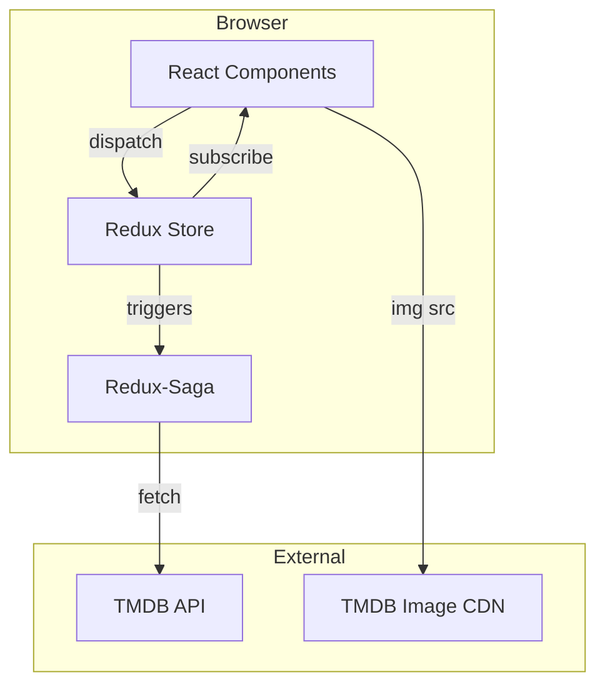
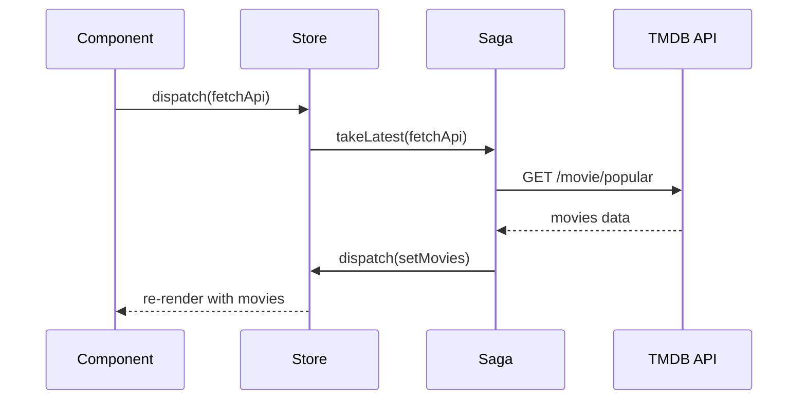
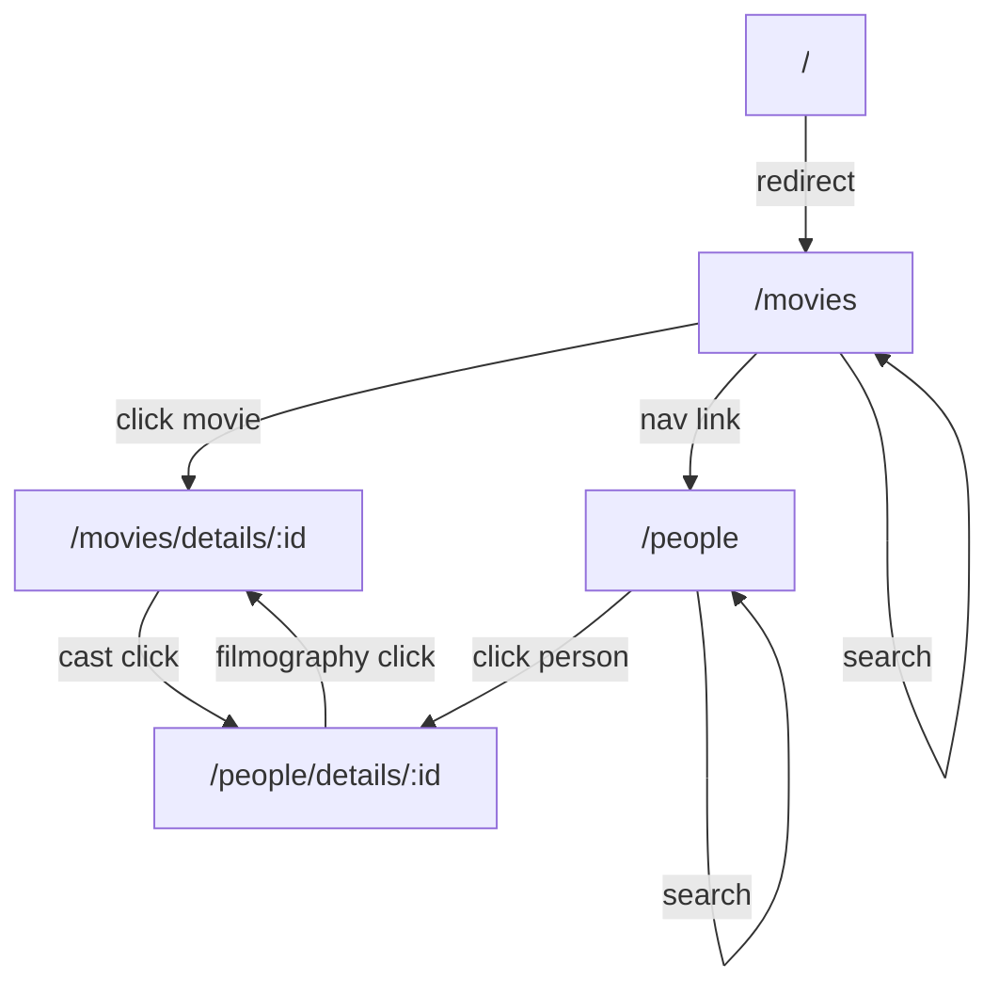
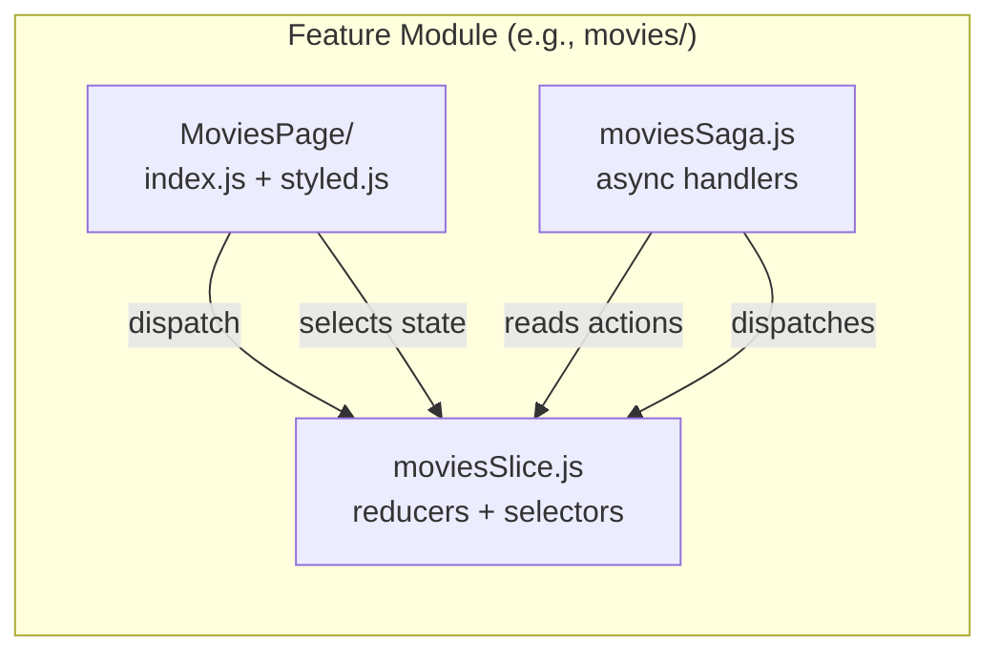
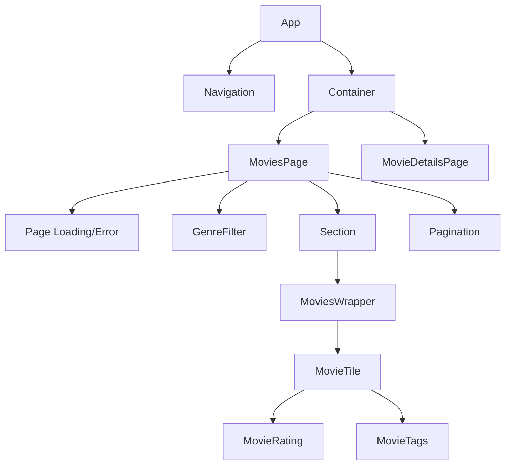
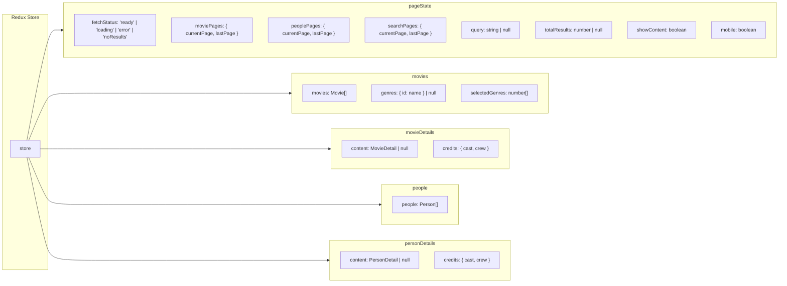
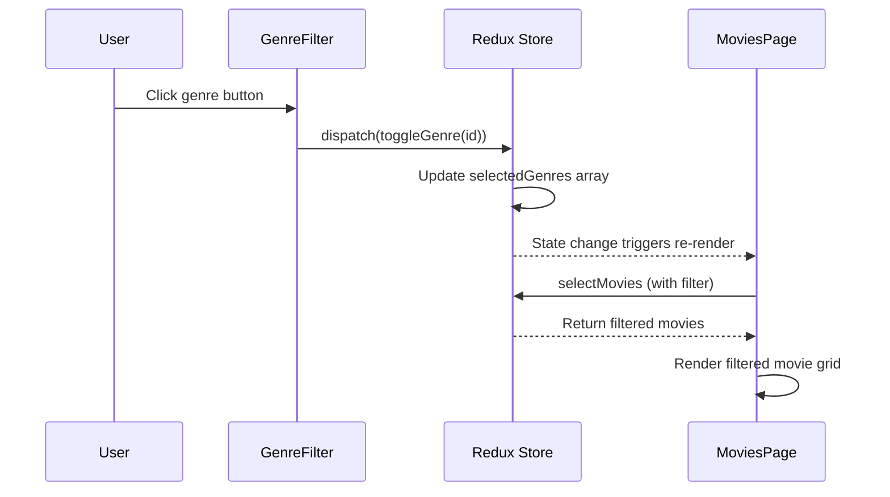
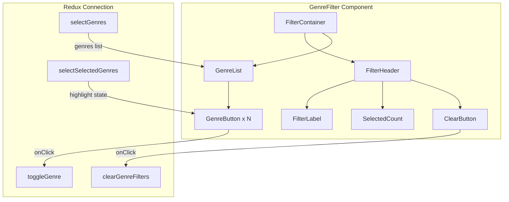

# Movies Browser - Technical Documentation

## 1. Project Overview

**Purpose**: A responsive web application for discovering and exploring popular movies and actors using The Movie Database (TMDB) API.

**High-level Functionality**:
- Browse paginated lists of popular movies and people
- Search movies and people by name
- View detailed movie information including cast, crew, ratings
- View person profiles with their filmography
- Responsive design adapting to mobile, tablet, and desktop

**Live Demo**: https://urbork.github.io/movies-browser/

---

## 2. Tech Stack

| Category | Technology | Version |
|----------|------------|---------|
| UI Framework | React | 18.2.0 |
| Routing | React Router DOM | 5.3.3 (HashRouter) |
| State Management | Redux Toolkit | 2.2.3 |
| Side Effects | Redux-Saga | 1.3.0 |
| Styling | Styled-Components | 6.1.8 |
| Testing | React Testing Library | 13.4.0 |
| Build Tool | Create React App | 5.0.1 |
| Deployment | gh-pages | 6.1.1 |
| External API | TMDB API | v3 |

---

## 3. Architecture Summary

**Style**: Feature-based architecture with Redux-Saga for side effect management

**Folder Structure**:
```
src/
├── api/           # API configuration and fetch wrappers
├── assets/        # Static assets (SVG icons)
├── components/    # Reusable presentational components
├── config/        # Redux store, saga orchestration, theme tokens
├── core/          # App shell (routing, navigation, global styles)
├── features/      # Feature modules (slice + saga + page component)
└── utils/         # Helper functions (routes, query params)
```

**State Shape** (Redux Store):
```
{
  pageState: { fetchStatus, moviePages, peoplePages, searchPages, query, ... }
  movies: { movies, genres, selectedGenres }
  people: { people }
  movieDetails: { movieDetails, cast, crew }
  personDetails: { person, cast, crew }
}
```

---

## 4. Core Features & Workflows

### Main Features
- **Movies List**: Paginated grid of popular movies with poster, title, year, rating, genres
- **People List**: Paginated grid of popular actors/crew
- **Movie Details**: Full movie info with backdrop, description, cast/crew sections
- **Person Details**: Biography and filmography (movies as cast/crew)
- **Search**: Real-time search with URL query parameter persistence
- **Genre Filter**: Multi-select genre filtering for movies

### Data Flow (User Action → UI Update)

```
1. User navigates to /movies?page=2
2. Component dispatches `fetchApi({ pathName: "/movies", page: 2 })`
3. pageStateSlice sets fetchStatus = "loading"
4. moviesSaga intercepts via takeLatest(fetchApi.type)
5. Saga calls getMovies(2) from fetchApi.js
6. TMDB API returns data
7. Saga dispatches setMovies(results), readyStatus()
8. moviesSlice and pageStateSlice update
9. Component re-renders with new movies
```

### Search Flow
- Search query stored in URL (`?search=batman`)
- `useQueryParameter` hook extracts query from URL
- Saga routes to search endpoint when query present
- Results replace regular movie/people list

### Genre Filter Flow
- User selects one or more genres from filter buttons
- Selected genres stored in Redux state (`selectedGenres` array)
- Movies are filtered client-side based on selected genres
- Filter persists across pagination
- Filter is hidden during search mode

---

## 5. Genre Filter Feature Implementation

### Overview
The genre filter allows users to filter movies by selecting one or more genres. Movies matching **any** of the selected genres are displayed (OR logic).

### Files Involved

| File | Purpose |
|------|---------|
| `src/components/GenreFilter/index.js` | Filter component with genre buttons |
| `src/components/GenreFilter/styled.js` | Styled components for filter UI |
| `src/features/movies/moviesSlice.js` | Redux state, actions, and selectors |
| `src/features/movies/MoviesPage/index.js` | Integration of filter into page |

### Redux State & Actions

**State** (`moviesSlice`):
```javascript
{
  movies: [],           // All fetched movies
  genres: null,         // Genre lookup object { id: name }
  selectedGenres: []    // Array of selected genre IDs
}
```

**Actions**:
- `toggleGenre(genreId)` - Adds or removes a genre from selection
- `clearGenreFilters()` - Clears all selected genres

**Selectors**:
- `selectSelectedGenres` - Returns array of selected genre IDs
- `selectMovies` - Returns filtered movies (applies genre filter automatically)
- `selectAllMovies` - Returns all movies without filtering

### Filter Logic

```javascript
// In moviesSlice.js - selectMovies selector
export const selectMovies = (state) => {
  const movies = selectAllMovies(state);
  const selectedGenres = selectSelectedGenres(state);

  if (selectedGenres.length === 0) {
    return movies;  // No filter applied
  }

  // OR logic: movie matches if it has ANY of the selected genres
  return movies.filter((movie) =>
    selectedGenres.some((genreId) => movie.genre_ids.includes(genreId))
  );
};
```

### Component Structure

**GenreFilter Component** (`src/components/GenreFilter/index.js`):
```
FilterContainer
├── FilterHeader
│   ├── FilterLabel ("Filter by genre")
│   ├── SelectedCount ("(X selected)")
│   └── ClearButton ("Clear filters")
└── GenreList
    └── GenreButton (one per genre, toggleable)
```

### UI Behavior

| Action | Result |
|--------|--------|
| Click unselected genre | Genre added to filter, button highlighted |
| Click selected genre | Genre removed from filter |
| Click "Clear filters" | All genres deselected |
| Enter search mode | Filter hidden (search takes precedence) |
| No matches found | "No movies found" message displayed |

### Styling

- **Unselected genre**: White background, grey border
- **Selected genre**: Blue background, white text
- **Hover state**: Light blue background
- **Responsive**: Smaller padding/font on mobile

### Dynamic Title

The section title updates based on filter state:
- No filter: "Popular movies"
- With filter: "Popular movies - Action, Comedy, Drama"
- Search mode: "Search results for 'query' (count)"

### Usage Example

```javascript
// In any component
import { useDispatch, useSelector } from "react-redux";
import {
  toggleGenre,
  clearGenreFilters,
  selectSelectedGenres
} from "../features/movies/moviesSlice";

const MyComponent = () => {
  const dispatch = useDispatch();
  const selectedGenres = useSelector(selectSelectedGenres);

  // Toggle a genre
  dispatch(toggleGenre(28)); // Action genre ID

  // Clear all filters
  dispatch(clearGenreFilters());
};
```

---

## 6. Key Components / Modules

### Feature Modules (`src/features/`)
| Module | Responsibility |
|--------|----------------|
| `movies/` | Popular movies list, search results, genres cache, genre filtering |
| `movieDetails/` | Single movie details, cast, and crew |
| `people/` | Popular people list and search |
| `personDetails/` | Single person bio and filmography |
| `pageStateSlice.js` | Global state: fetch status, pagination, search query |

### Reusable Components (`src/components/`)
| Component | Responsibility |
|-----------|----------------|
| `MovieTile` | Renders individual movie card (poster, title, rating) |
| `PeopleTile` | Renders individual person card (profile image, name) |
| `MovieRating` | Star icon with vote average and count |
| `MovieTags` | Genre tag pills |
| `Pagination` | First/prev/next/last page controls |
| `Page/` | Loading spinner, error message, no results states |
| `Section` | Titled section wrapper (e.g., "Cast", "Crew") |
| `Details` | Shared detail page layout |
| `GenreFilter` | Multi-select dropdown for filtering movies by genre |

### Core Modules (`src/core/`)
| Module | Responsibility |
|--------|----------------|
| `App/` | HashRouter setup and route definitions |
| `Navigation/` | Top nav bar with links and search input |
| `GlobalStyle.js` | CSS reset and base styles |

### API Layer (`src/api/`)
| File | Responsibility |
|------|----------------|
| `api.js` | TMDB endpoint URLs and image size constants |
| `fetchApi.js` | Fetch wrappers for each endpoint |

---

## 7. Setup & Execution

```bash
# Clone repository
git clone https://github.com/Urbork/movies-browser.git
cd movies-browser

# Install dependencies
npm install

# Start development server (http://localhost:3000)
npm start

# Run tests
npm run test

# Build for production
npm run build

# Deploy to GitHub Pages
npm run deploy
```

**Environment**: No `.env` file required - API key is embedded in code.

---

## 8. Assumptions & Limitations

### Hardcoded Values
- **API Key**: Exposed in `src/api/api.js:2` - security risk for production
- **Max Pages**: Hardcoded to 500 in `pageStateSlice.js:11-12`
- **Mobile Breakpoint**: Calculated once at module load (`window.innerWidth < 480px`)
- **Delay**: 500ms artificial delay in sagas before fetching

### Missing Pieces
- **No TypeScript**: Plain JavaScript without type safety
- **No Error Boundaries**: Errors may crash the entire app
- **No Caching Strategy**: Re-fetches on every navigation
- **No Unit Tests**: Testing library present but tests not found
- **No i18n**: English only (`language=en-US` hardcoded)
- **No Rate Limiting Handling**: TMDB rate limits not addressed

### Architectural Decisions
- **HashRouter**: Used for GitHub Pages compatibility (no server-side routing)
- **React Router v5**: Older version; uses `<Switch>` instead of v6 `<Routes>`
- **Global PageState**: Single slice manages loading/pagination across all features

### Uncertainties
- Genre list cached in movies slice but not persisted across sessions
- Mobile state set at load time but may not update on resize
- Search debouncing relies on saga's 500ms delay, not input debounce

---

## 9. Diagram Suggestions

### 1. System Architecture Diagram
**Purpose**: Show the overall system components and their relationships
**Type**: Component diagram
**Should Include**: React app, Redux store, Redux-Saga middleware, TMDB API, GitHub Pages hosting



### 2. Redux Data Flow Diagram
**Purpose**: Illustrate the unidirectional data flow with sagas
**Type**: Sequence diagram
**Should Include**: Component, Action, Reducer, Saga, API, Store



### 3. Route Navigation Flowchart
**Purpose**: Map all application routes and navigation paths
**Type**: Flowchart
**Should Include**: All 4 routes, redirects, search flow



### 4. Feature Module Structure
**Purpose**: Show the pattern used within each feature folder
**Type**: Component/package diagram
**Should Include**: Slice, Saga, Page component, their relationships



### 5. Component Hierarchy Diagram
**Purpose**: Show the component tree for main pages
**Type**: Tree diagram
**Should Include**: App shell, page components, reusable components



### 6. State Shape Diagram
**Purpose**: Visualize the Redux store structure
**Type**: Entity/object diagram
**Should Include**: All 5 slices with their key properties



### 7. Genre Filter Flow Diagram
**Purpose**: Show the genre filter user interaction and data flow
**Type**: Sequence diagram
**Should Include**: User action, component, Redux actions, state update, re-render



### 8. Genre Filter Component Diagram
**Purpose**: Show the GenreFilter component structure
**Type**: Component diagram



---

## 10. Features Added

### Feature 1: Dark Mode Toggle
**Branch**: `feature-darkMode`
**Key Files**: `src/components/ThemeToggle/index.js`, `src/features/themeSlice.js`, `src/config/theme.js`

Adds a light/dark theme toggle button to the navigation bar. The theme state is managed via a Redux slice (`themeSlice`) and persisted to `localStorage`, so the user's preference is remembered across sessions. The toggle displays a moon icon in light mode and a sun icon in dark mode. All styled-components consume theme tokens, so the entire UI adapts seamlessly when the theme switches.

---

### Feature 2: Watchlist / Favorites
**Branch**: `feature-watchlist`
**Key Files**: `src/features/watchlist/watchlistSlice.js`, `src/components/WatchlistButton/index.js`, `src/features/watchlist/WatchlistPage/`

Allows users to add or remove movies from a personal watchlist using a heart-shaped toggle button on movie tiles and the movie detail page. The watchlist is stored in both Redux state and `localStorage` for persistence. A dedicated Watchlist page displays all saved movies in the same grid layout as the main movies page. A watchlist count badge appears in the navigation bar so users can see how many movies they've saved.

---

### Feature 3: Similar Movies
**Branch**: `feature-similarMovies`
**Key Files**: `src/features/movieDetails/movieDetailsSlice.js`, `src/features/movieDetails/movieDetailsSaga.js`, `src/features/movieDetails/MovieDetailsPage/index.js`

Displays a "Similar Movies" section at the bottom of the movie detail page. When a movie detail page loads, the saga fetches similar movies from the TMDB `/movie/{id}/similar` endpoint in parallel with existing detail and credits requests. Results are stored in the Redux slice and rendered as a horizontally scrollable row of movie tiles, each linking to its own detail page.

---

### Feature 4: Recently Viewed
**Branch**: `feature-recentlyViewed`
**Key Files**: `src/utils/recentlyViewed.js`, `src/components/RecentlyViewed/index.js`, `src/components/RecentlyViewed/styled.js`

Tracks the last 20 movies and people the user has visited, stored in `localStorage`. A "Recently Viewed" section appears on the Movies page showing thumbnail cards in a horizontal scrollable row. Each card links back to the corresponding movie or person detail page. The utility module provides `addRecentlyViewed`, `getRecentlyViewed`, and `clearRecentlyViewed` functions. Items are deduplicated and ordered most-recent-first.

---

### Feature 5: Advanced Filters
**Branch**: `feature-advancedFilters`
**Key Files**: `src/components/AdvancedFilters/index.js`, `src/components/AdvancedFilters/styled.js`

Adds a filter panel above the movie grid with four controls:
- **Sort by** — Dropdown to sort by popularity, rating, release date, or revenue
- **Min rating** — Number input to filter movies by minimum vote average
- **Year from / Year to** — Year range filter for release dates

All filter values are stored as URL query parameters, making filtered views shareable and bookmark-friendly. A "Reset filters" button clears all active filters at once. The filters integrate with the existing saga-based data flow, passing parameters to the TMDB discover endpoint.

---

### Feature 6: YearPicker Enhancement
**Branch**: `feature-enhanceFilters`
**Key Files**: `src/components/YearPicker/index.js`, `src/components/YearPicker/styled.js`

Replaces the plain number input for year filtering with a custom dropdown year picker. The picker displays years in a grid (12 per page) with decade-based navigation arrows to browse from 1900 to the current year. Features include:
- Click-outside-to-close behavior
- A clear button to reset the selection
- Keyboard-accessible navigation
- Debounced min rating input (800ms delay) to avoid excessive API calls while typing

---

### Feature 7: Collapsible Filters Toggle
**Branch**: `feature-collapsibleFilters`
**Key Files**: `src/components/AdvancedFilters/index.js`, `src/components/AdvancedFilters/styled.js`

Adds a collapsible toggle to the Advanced Filters panel to save vertical space. The filter controls are collapsed by default, showing only a header row with the label "Advanced Filters", a chevron indicator, and the Reset button. Clicking the header smoothly expands or collapses the filter controls using a `max-height` CSS transition. When filters are active and the panel is collapsed, a small blue dot badge appears next to the label so users know filters are applied without needing to expand the panel.

| State | What's Visible |
|-------|---------------|
| Collapsed, no filters | "Advanced Filters >" + disabled Reset |
| Collapsed, filters active | "Advanced Filters >" + blue dot + enabled Reset |
| Expanded | "Advanced Filters v" + Reset + all filter controls |

---

This documentation should enable new developers to understand the codebase structure, locate relevant files, and contribute effectively.
